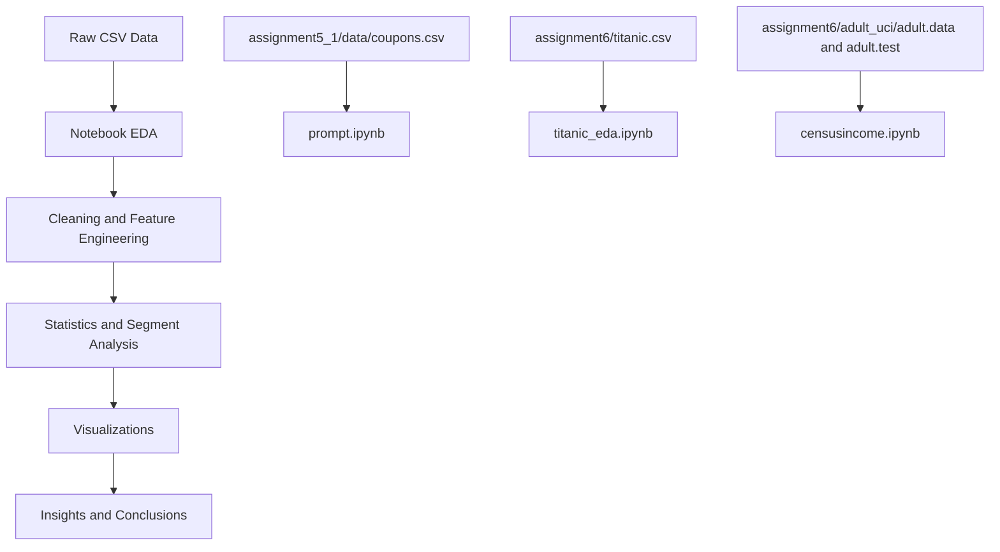
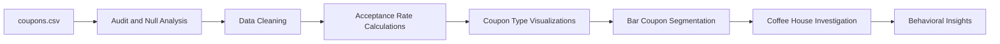
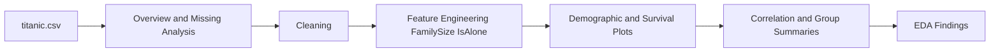
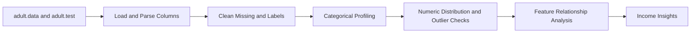

# UCB AIML Repository: Exploratory Data Analysis Projects

This repository contains exploratory data analysis work implemented in Jupyter notebooks using Python.

## Latest Changes

- Added `assignment6/censusincome.ipynb` for Adult (Census Income) EDA.
- Added Adult dataset files in `assignment6/adult_uci/`:
  - `adult.data`
  - `adult.test`
- Added `requirements.txt` to simplify environment setup.

## Repository Structure

```text
UCB-AIMLrepo/
├── assignment5_1/
│   ├── README.md
│   ├── data/
│   │   └── coupons.csv
│   ├── images/
│   │   ├── figure_01.png
│   │   ├── ...
│   │   └── figure_09.png
│   └── notebook/
│       └── prompt.ipynb
├── assignment6/
│   ├── adult_uci/
│   │   ├── adult.data
│   │   └── adult.test
│   ├── censusincome.ipynb
│   ├── titanic.csv
│   └── titanic_eda.ipynb
├── requirements.txt
└── README.md
```

## Projects Included

### 1) Assignment 5.1: Coupon Acceptance Analysis
- Notebook: `assignment5_1/notebook/prompt.ipynb`
- Dataset: `assignment5_1/data/coupons.csv`
- Focus: Analyze factors that influence whether drivers accept coupons.

#### Code Workflow (Assignment 5.1)
1. Import libraries (`pandas`, `numpy`, `matplotlib`, `seaborn`, `IPython.display`).
2. Load and audit data (`shape`, null checks, basic summaries).
3. Clean/normalize fields (notably handling nulls in `car` and related cleanup).
4. Compute global acceptance rate.
5. Visualize coupon categories and acceptance rates.
6. Deep-dive on **Bar** coupons with segment comparisons.
7. Independent deep-dive on **Coffee House** coupons by behavior/context.

#### Key Outputs Captured in Notebook
- Overall coupon acceptance rate: **56.93%**
- Bar coupon acceptance rate: **41.19%**
- Coffee coupon acceptance rate: **49.63%**
- Visuals exported in `assignment5_1/images/`.

### 2) Assignment 6A: Titanic EDA
- Notebook: `assignment6/titanic_eda.ipynb`
- Dataset: `assignment6/titanic.csv`
- Focus: Exploratory analysis of survival patterns.

#### Code Workflow (Assignment 6)
1. Imports and setup.
2. Basic dataset overview and descriptive stats.
3. Missing-value analysis and handling.
4. Demographic plots (age/sex/class).
5. Feature engineering:
   - `FamilySize = Siblings/Spouses Aboard + Parents/Children Aboard + 1`
   - `IsAlone`
6. Survival-focused comparisons (boxplots, grouped rates, correlations).
7. Auto summary of findings.

#### Key Notebook Findings
- Survival by sex:
  - Female: `0.742`
  - Male: `0.190`
- Survival by passenger class:
  - Class 1: `0.630`
  - Class 2: `0.473`
  - Class 3: `0.244`
- Mid-size families show better survival than solo passengers.

### 3) Assignment 6B: Census Income (Adult) EDA
- Notebook: `assignment6/censusincome.ipynb`
- Datasets:
  - `assignment6/adult_uci/adult.data`
  - `assignment6/adult_uci/adult.test`
- Focus:
  - Cleaning and profiling the Adult income classification dataset.
  - Categorical and numeric feature analysis.
  - Relationship analysis for income (`<=50K` vs `>50K`).

## Important Libraries

The notebooks rely on:
- `pandas`
- `numpy`
- `matplotlib`
- `seaborn`
- `IPython` (`IPython.display` in assignment5_1)
- `jupyter` / `notebook` runtime

Install with:

```bash
pip install -r requirements.txt
```

## How To Run the Code

### Option A: Run interactively in Jupyter

```bash
# from repo root
jupyter notebook
```

Then open and run:
- `assignment5_1/notebook/prompt.ipynb`
- `assignment6/titanic_eda.ipynb`
- `assignment6/censusincome.ipynb`

### Option B: Run in VS Code Notebook UI
1. Open repo folder.
2. Select Python interpreter with required packages.
3. Open each notebook and run all cells.

## Data and Analysis Flow Diagrams

### High-level repository workflow



### Assignment 5.1 pipeline



### Assignment 6 pipeline



### Assignment 6B pipeline



## Notes
- `assignment5_1/README.md` is project-specific and includes embedded figures.
- This root README summarizes all notebooks and how to execute them end-to-end.
