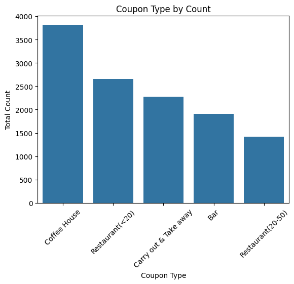
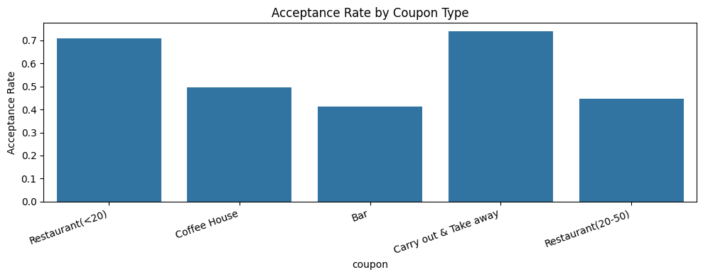
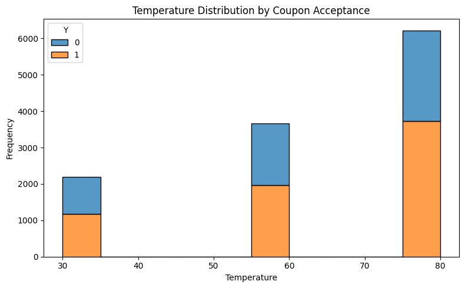
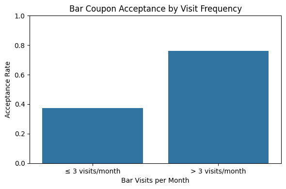
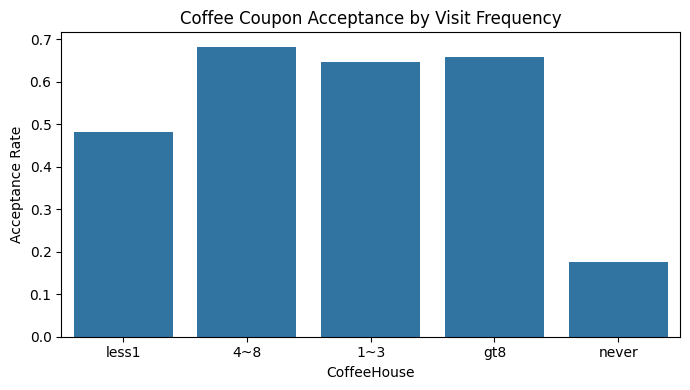
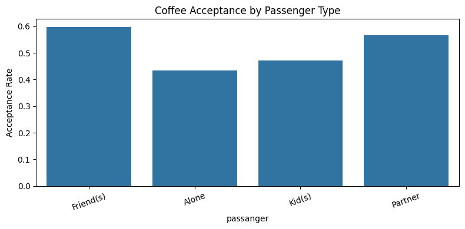
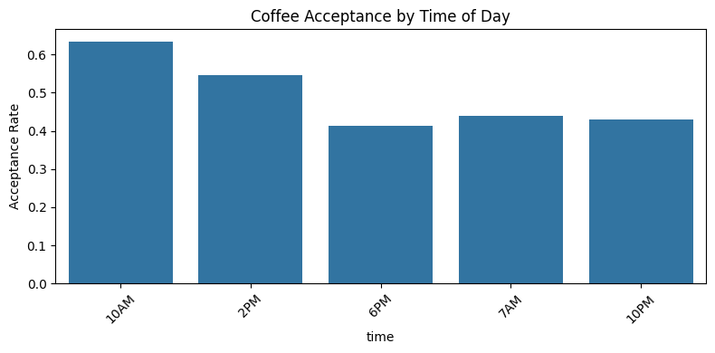
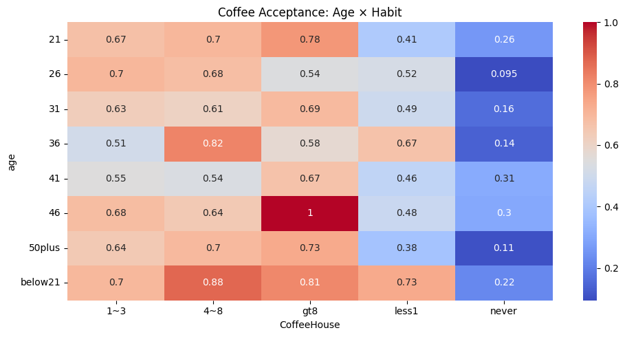
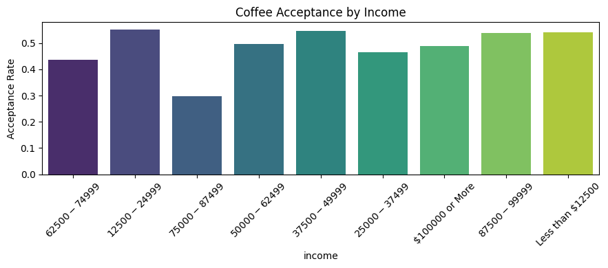

# Coupon Acceptance Analysis (Assignment 5.1)

## Overview
This repository contains a notebook analyzing the UCI driving-coupon dataset. It compares customers who accepted coupons with those who did not, using summary statistics and visualizations.

Notebook:
- `notebook/prompt.ipynb`

Data:
- `data/coupons.csv`

## Broader Analysis Summary
The analysis begins with a data quality audit (shape, missingness, and descriptive statistics), followed by a light cleaning step to standardize the `car` column and remove remaining rows with nulls. It then quantifies the overall coupon acceptance rate and visualizes acceptance patterns across coupon types and temperature. The notebook moves into targeted segment analysis: it explores bar coupons with multiple behavioral and demographic splits (bar-visit frequency, age, passenger type, occupation, marital status, and income), and conducts an independent deep dive on coffee house coupons to examine habit strength, passenger context, time of day, age-by-habit interactions, and income effects. Across these sections, the analysis relies on bar plots and a heatmap to compare acceptance rates between groups and to highlight where acceptance is most concentrated.

## Brief Nontechnical Report: Accepted vs Not Accepted
**Executive summary:** Acceptance is mostly driven by lifestyle fit and immediate context. Coupons tend to reinforce existing habits rather than change behavior.

Key differences observed in the notebook:
- **Habit alignment:** People who already visit a venue type (bar or coffee house) more frequently are much more likely to accept that coupon. Infrequent visitors are less likely to accept.
- **Social context:** Acceptance is higher when passengers are friends or a partner and lower when passengers include kids, indicating immediate feasibility matters.
- **Life stage and age:** Younger drivers (especially under 30) show higher acceptance, suggesting more spontaneity or flexibility.
- **Value sensitivity:** Lower-income groups and those who frequently visit inexpensive restaurants show higher acceptance, indicating coupons appeal to value-conscious customers.
- **Timing (coffee):** Morning hours show higher acceptance for coffee house coupons, aligning with routine caffeine demand.

Overall, customers who **accept coupons** tend to be habitual visitors, in socially compatible situations, and more flexible or value-sensitive. Customers who **do not accept** tend to have lower relevance to the venue type, less flexible passenger situations, or mismatched timing.

## Visual Outputs from `prompt.ipynb`
Below are all plots embedded in the notebook, exported to PNG.

**Figure 1.**

**Figure 2.**

**Figure 3.**

**Figure 4.**

**Figure 5.**

**Figure 6.**

**Figure 7.**

**Figure 8.**

**Figure 9.**

